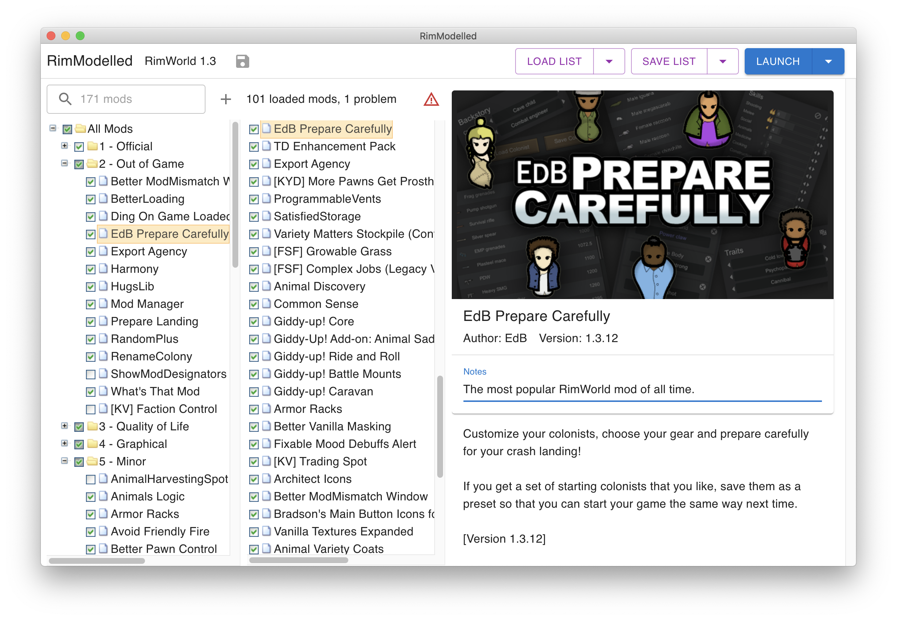

RimModelled is a mod manager for [RimWorld](https://rimworldgame.com). It allows you to enable and reorder mods, and provides features to organize them.

## Features

- :open_file_folder: Organize your mods into folders for easy access.
- :mag: Search your mod list.
- :thinking: Add a note to any mod or folder (remind yourself why you have a mod disabled).
- :zap: Load the mod list of an existing save (stop restarting RimWorld to change the mods).
- :handshake: Save modlists for later use, or copy to clipboard (compatible with [Fluffy Mod Manager](https://github.com/fluffy-mods/ModManager)).
- :tv: [Watch a demo](https://vimeo.com/641769692) for details!

## Installation

Presently, RimModelled only works on macOS with Steam. If you fall into that bucket, then you can download the latest from the [releases](https://github.com/CGamesPlay/RimModelled) page.

If you don't fall into that bucket, not to worry! RimModelled should work fine with Windows, Linux, and the DRM-free version. However, I haven't been able to test them yet. If you want to be a guinea pig, open up [an issue](https://github.com/CGamesPlay/RimModelled/issues)!

## Future

The roadmap for RimModelled is flexible, but I'd like to add these features in the future:

- Support for Windows, Linux, and DRM-free versions of RimWorld.
- A graphical overhaul. If you would like to contribute a logo or theme for the app, [get in touch](https://github.com/CGamesPlay/RimModelled/issues)!
- Keyboard shortcuts.
- Translations to other languages.
- Deeper integration with Steam Workshop (open mod in Workshop, unsubscribe from mod, etc.).

If you would like to see something in RimModelled, let me know via [an issue](https://github.com/CGamesPlay/RimModelled/issues).

## Community

RimModelled is open source software licensed under the MIT license. Contributions from the RimWorld community are welcomed, and all contributors are expected to follow the guidelines set forth in the [Contributor Covenant Code of Conduct](https://www.contributor-covenant.org/version/2/1/code_of_conduct/).

